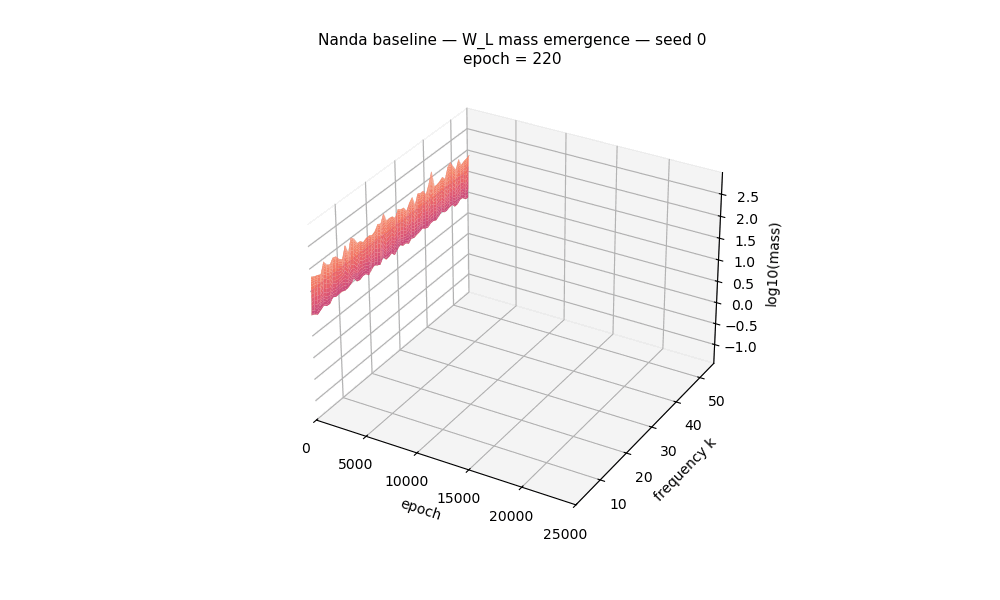

# Probing optimizer dynamics in grokking
## EPFL, CS-439 Mini-project



## Our object of study

A study of how the choice of optimizer may influence the grokking dynamics on Nanda et al. (2023)'s modular-addition setup. The task `(a + b) mod 113`, the one-layer ReLU transformer, and the 30 % training split are kept fixed. AdamW (baseline) is compared against two matrix-normalized optimizers, Muon and Egalitarian Gradient Descent (EGD). The mechanistic toolkit of Nanda et al. is reused as a set of progress measures, tracked across five seeds per configuration. Matrix-normalized optimizers expand the grokking hyperparameter region, accelerate generalization, and produce wider Fourier circuits than the AdamW baseline.

## Install

```bash
python -m venv .venv
source .venv/bin/activate
pip install -r requirements.txt
```

Auto-detects CUDA, then MPS, then CPU.

## Run

Open `run.ipynb` and execute top to bottom. Training is resume-aware: any seed already on disk under `runs/` is skipped.

The notebook walks through:

1. Grid search over learning rate and weight decay on two seeds per optimizer.
2. Phase 1: retrain the "best" choosen configs on five seeds, no Fourier logging.
3. Key-frequency identification on each trained `W_L`.
4. Phase 2: retrain again with the key frequencies fixed and Fourier metrics logged every 10 steps.
5. Phase 3: per-seed timing markers.

Per-config training curves land in `figs_phase1/`, the Fourier loss decomposition and `W_L` mass plots in `figs_phase2/`, and the participation-ratio width and `T_circuit` vs `T_grok` scatter in `figs_phase3/`. The marker CSV used by the synthesis figures is written to `analysis_csv/`.

## Files

- `model.py` - one-layer ReLU transformer following Nanda's reference setup.
- `pipeline.py` - `OptimizerSpec`, `Trainer`, `run_multi_seed`, `grid_search`.
- `fourier_metrics.py` - Fourier basis over Z_p and key-frequency concentration measures.
- `viz_analysis.py` - data loading, marker extraction, and plotting functions.
- `optimizer/` - vendored Muon, EGD.
- `run.ipynb` - main entry point.

## Outputs

- `runs/<config>/seed<n>/` - `history.json` and `meta.json` are tracked; `model.pt` and `optim.pt` are ignored.
- `figs_phase1/`, `figs_phase2/`, `figs_phase3/` - saved plots (ignored).
- `analysis_csv/` - per-seed timing markers CSV (ignored).

## Reference

Ciardo, J., Oyebanji, J., Verest, M. *Probing optimizer dynamics in grokking setting*. EPFL Lausanne.
